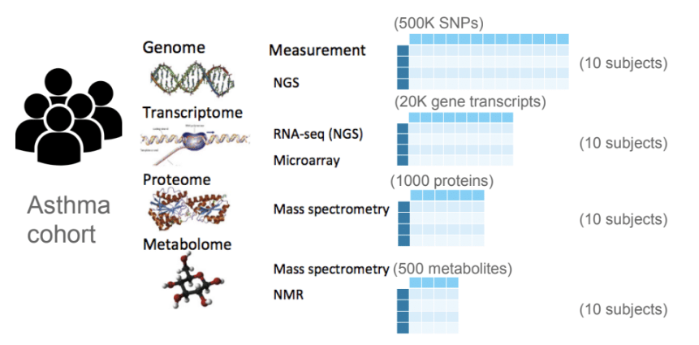
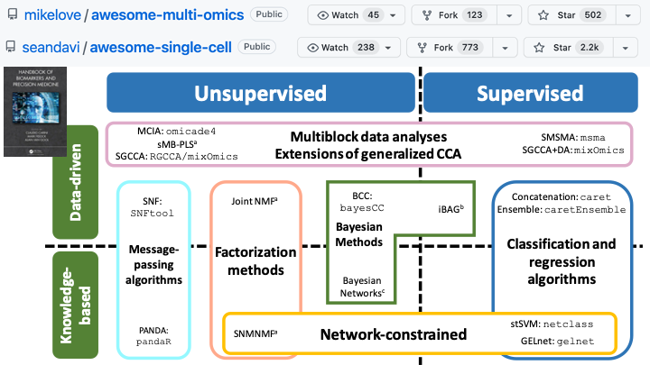
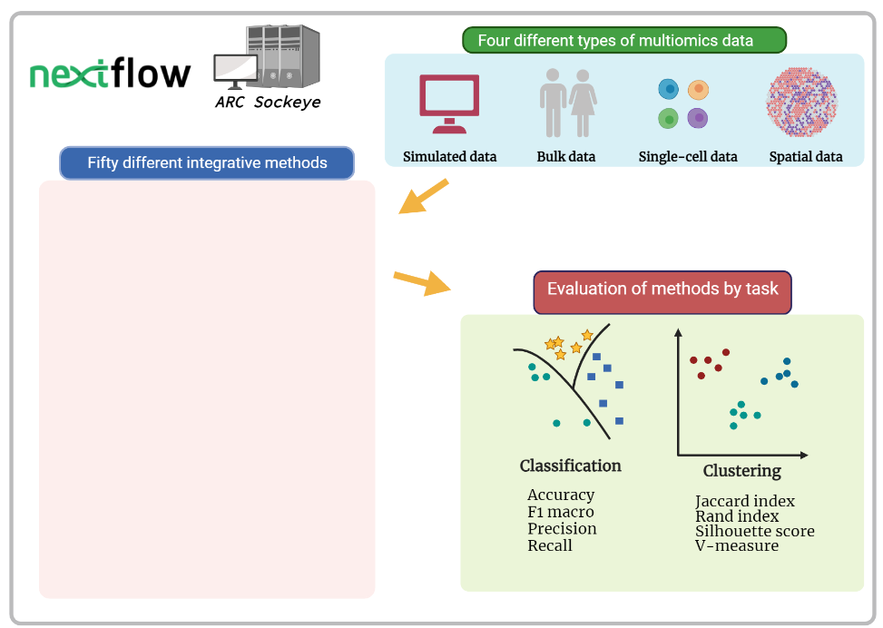
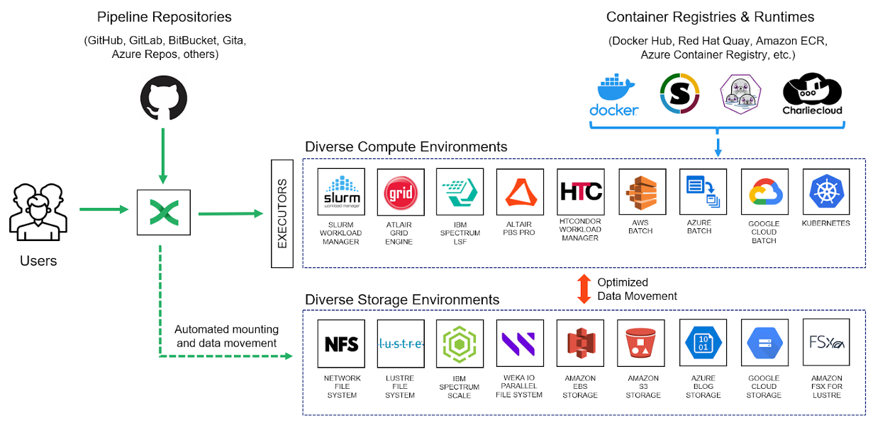

layout: true

<div class="my-footer"><span><a href="https://tonyliang19.github.io/ssrip_2023" style="color:white">tonyliang19.github.io/ssrip_2023</a></span></div> 

```{r setup, include=FALSE, echo=FALSE}
# Dont modify this chunk
source("rmd_config.R")
```

```{r css-extras, file="css-extras.R", echo=FALSE}
# Dont remove this
```

---

background-image: url(materials/img/website_bkg.png)
background-position: top
background-size: contain


<br/><br/><br/><br/><br/><br/><br/><br/><br/><br/><br/>
.center[### Benchmarking integrative multiomics methods for disease classification and biomarker discovery]


.pull-left[
<br/>
####Tony Liang
#### Supervisor: Dr. Amrit Singh
####University of British Columbia
<!---
####`r Sys.Date()`
---->
]

.pull-right[.center[.middle[
<br/>
<table>
<tr>
<td></td>
<td></td>
<td></td>
</tr>
<tr>
<td>`r fa("chalkboard-teacher")` Slides</td>
<td>`r fa("code")` Code</td>
<td>`r fa("at")` Lab website</td>
</tr>
</table>
]]]

???

* Explain a little in the QR
* Thanks to compbio lab to allow this project, everyone helped!


---

# Land acknowledgement

.pull-left[
**I would like to acknowledge that I work on the traditional, ancestral, and unceded territory of the Coast Salish Peoples, including the territories of the xwməθkwəy̓əm (Musqueam), Skwxwú7mesh (Squamish), Stó:lō and Səl̓ílwətaʔ/Selilwitulh (Tsleil- Waututh) Nations.**

*Traditional*: Traditionally used and/or occupied by Musqueam people

*Ancestral*: Recognizes land that is handed down from generation to generation

*Unceded*: Refers to land that was not turned over to the Crown (government) by a treaty or other agreement

]

.pull-right[
.center[]
]

---

## Motivation

- Multiomics is a new emerging field of study

- Many methods, but which one is best at what case?

- Strategy of integrating multiomics data

- "Gap" between biologists and computer-based multiomics methods.


<!---

- Machine learning (`ML`) methods 

- Reproducible workflows and parallel computation

- Lack of CS knowledge in generic biological field

- "Advanced" data science

- **Multiomics** problem could also be viewed as mathematical or statistical problem
--->

- **Multiomics** problem could also be viewed as mathematical or statistical problem

???

* Dont take too long in explain this
* Try making a 'consecutive' story


---

## Outline

.pull-left[
.large[Background]
 
 - **Multiomics**
 
 - **Data integration**
 
<!----
 - .secondary[Nextflow]
 - UBC ARC and Apptainer
 
---->

.large[Objectives]

.large[Methods]


.large[Expected Results]

.large[Conclusion ]

.large[Acknowledgements]

.large[.footnote[
For code to original repo see [.secondary[here]](https://github.com/tonyliang19/multiomics-pipeline)
]]
]

---

## Multiomics Data

Profiling of different molecular measurements (i.e. genes, proteins, metabolites) from same biological samples.

.pull-left[

- Compensate for missing or unreliable information in any single `omics` data

- Multiple source of evidence pointing to same biological process are more likely


<br>

**Omics** is the comprehensive study of all molecules of a particular type within an organism.

- Each `omics` data follow $N \times P$ structure
  + $N =$ Samples of Observations
  
  + $P =$ Predictors/variables
  
  + High dimensional, $N << P$
]

.pull-right[
<br>

<br>



]

???

* Dont go into too much detail of math
* Use simple language

---

### Multiomics Data Integration

.center[

]

???

* Left is typical example of bulk
* Right is most types of methods (there are more)

---

## Objectives

The objective is to benchmark methods for multiomics data integration by:

1. Curating publicly available multiomics data

2. Applying existing methods to simulated and real world datasets

3. Compare methods based on 
  + **classification accuracy **
  
  + **features selected**
  
  + **computation time**, etc

???

* Keep it short, since all details is explained in methods

---

<!----
background-image: url(materials/img/workflow.png)
background-size: contain
background-position: middle, center
----->

.center[]

???

* Explain, this is generic workflow of the pipeline

---

### Data

.pull-left-narrow[

- Simulated data 

- Bulk data (.secondary[Majority])

- Single-cell data

- Spatial data
]

.pull-right-wide[

]


Many of these data are **high dimensional**, quite abstract to illustrate in plain words.


???

Briefly explain what each consits of

Bulk -> majority of multiomics, this one ignores cell-type indenty, most basic one

Single-cell -> new single cell technologies like CITE-seq , scRNA-seq, scATAC-seq and ECCITE-seq

Spaital -> Spatial distirbution of cells is known

---

## Methods

- Using **Nextflow** that eases writing of data-intensive computational pipelines

- Running these pipelines on **UBC Advanced Research Computing cluster Sockeye**

.pull-left-narrow[
.secondary[Curate multiomics data from open-source databases
]

- Collect different omics data from same samples

- AnnData for `Python`

- MultiAssayExperiment for `R`

- Normalization , batch correction
]

.pull-right-wide[
.secondary[ `Benchmarking` integrative multiomics methods
]

- Evaluate series of methods based on their tasks with classic metrics

- Compare methods on different types of multiomics data

- Develop method that improve the predictive performance and
interpretability of the results.

- Use computational power and CS parallel algorithm with Nextflow and UBC ARC Sockeye
]


---

background-image: url(materials/img/nextflow-story.png)
background-size: contain
class: middle, center

<!----
.pull-left-narrow[

]
--->

<!---
.pull-left[

]
--->

<!---
.pull-right-wide[

]
---->

<!---
.pull-left[
- Highly customizable

- Parallel computation

- Portable in multiple platforms
]
.pull-right[

- Community pipelines and support

- Any programming Language

- `r con` Requires some CS knowledge

]
--->


???

Only briefly mention the platform used and the bullets.
Rest could be explained in methods

---

## Expected Results

<!--- Replace with other xlsx here from Amrit --->

.large[ 1\. Availability of list of curated multiomics dataset]

```{r data_table, eval=TRUE, echo=FALSE, warning=FALSE}
# read data loaded from data-curation.R
# and source from setup chunk
DT::datatable(
  data_tab,
  fillContainer = FALSE,
  options=list(pageLength=2,scrollX=TRUE, 
               searching=FALSE, dom='ftp')
) %>%
  DT::formatStyle(columns = colnames(data_tab), fontSize = '85%')
```


<!---
.large[]
--->

.footnote[
This is a yet to be updated data table (under curation)
]

---

## Expected Results

.large[2\. Web portal app to quickly denote a method suitable to your custom data.]


- Time, error rates, number of features selected by method
  + Simulated (with/without noise)
  
  + Real dataset

<!---  
.emphasis[`r pro` Easily scalable to your own computing cluster]
--->

---

### Limitations and Future Direction

`r con` Collection and clean process of multiomics data

`r con` Missing source or supplementary materials from evaluated methods/papers

`r pro` Feedback to bioinformatics or general research community

`r pro` Extendable to other field that requires intensive computation

`r pro` Save time from selecting reproducible ML methods for biological problem


.emphasis[
You don't need to understand tons of cs to use this project
]


---

## Conclusion

1. The best performing methods on the real-world data will provide insights into why certain methods are better than others with respect predictive performance and capturing the correct underlying biological processes. 

2. Inform the development of a new integrative method that is applicable to different types of multiomics data.

3. Highly relevant to the community utilizing multiomics data for
their research.
  + Ease of use
  + Collaborations
  + Development of new tool

---

class: middle
background-image: url(materials/img/website_bkg.png)
background-position: top
background-size: contain

<br>
<br>
<br>

.large[.secondary[Thanks to my lab, the [CompBio Lab](https://cbl-hli.med.ubc.ca/)]]
.pull-left[
- Dr. Amrit Singh
- Dr. Dantong Zhu
- Dr. Young Woong Kim
- Dr. Maryam Ahmadzadeh
- Michael Yoon
]
.pull-right[
- Jeffrey Tang
- Rishika Daswani
- Roy He
- Samuel Leung
- Akshdeep Sandhu
- Asees Singh
]

<br>

And acknowledging to UBC ARC, work learn,  and Nextflow for enabling the successful execution of  this project.

.large[
.footnote[
For more information regarding Nextflow, please check [here](https://www.nextflow.io/)
]]


<!----
Credits to:

  [Stat 406 Lecture Slides @DJM](https://ubc-stat.github.io/stat-406/)

<br><br>
----->

