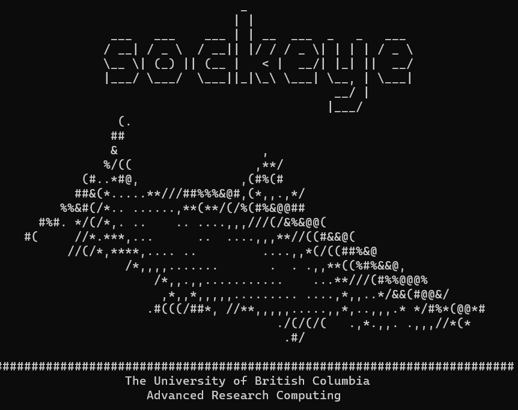

```{r setup, include=FALSE, echo=FALSE}
# Dont modify this chunk
source("rmd_config.R")
```

```{r css-extras, file="css-extras.R", echo=FALSE}
# Dont remove this
```

# Land acknowledgement

.pull-left[
**I would like to acknowledge that I work on the traditional, ancestral, and unceded territory of the Coast Salish Peoples, including the territories of the xwməθkwəy̓əm (Musqueam), Skwxwú7mesh (Squamish), Stó:lō and Səl̓ílwətaʔ/Selilwitulh (Tsleil- Waututh) Nations.**

*Traditional*: Traditionally used and/or occupied by Musqueam people

*Ancestral*: Recognizes land that is handed down from generation to generation

*Unceded*: Refers to land that was not turned over to the Crown (government) by a treaty or other agreement

]

.pull-right[
.center[]
]

---

## Outline

.pull-left[
.large[Background]
 - .secondary[Mult-omics data integration]
 - .secondary[Nextflow]
 - UBC ARC and Apptainer
 

.large[Research Questions]

.large[Methods]

.large[Expected Results]

.large[Conclusion ]

.large[Acknowledgements]

.large[.footnote[
For code to original repo see [.secondary[here]](https://github.com/tonyliang19/multi-omics-pipeline)
]]
]

.pull-right[
.center[]
]


---

## Motivation

- Various machine learning methods
- Parallel computation
- Lack of CS knowledge in generic biological field
- "Advanced" datascience
- Helps community to determine

.larger[.secondary[ADD on later]]

---

## Multi-Omics Data Integration

---
## Nextflow


.pull-left[

]
.pull-right[

]


.pull-left[
- Highly customizable

- Parallel computation

- Portable in multiple platforms
]

.pull-right[

- Community pipelines and support

- Any programming Language

- `r con` Requires some CS knowledge

]

???

Only briefly mention the platform used and the bullets.
Rest could be explained in methods

---

class: center
<!---
background-image: url(materials/img/arc.png)
background-size: 55%
---->

### UBC Advanced Research Computing (ARC) Sockeye and Apptainer
<br>

.pull-left[

]

<br>

.pull-right[

]

???

Only briefly mention the platform
Rest could be explained in methods

---

background-image: url(materials/img/workflow.png)
background-size: contain
background-position: middle, center

---

### Research Questions

- Curate multi-omics data from open-source databases

- `Benchmarking` integrative multi-omics methods

---

### Data

- Simulated data 

- Bulk data (.secondary[Majority])

- Single-cell data

- Spatial data

Many of these data are **high dimensional**, quite abstract to illustrate in plain words.


???

Briefly explain what each consits of

Bulk -> majority of multiomics, this one ignores cell-type indenty, most basic one

Single-cell -> new single cell technologies like CITE-seq , scRNA-seq, scATAC-seq and ECCITE-seq

Spaital -> Spatial distirbution of cells is known

---

## Methods

- .large[Data curation]

- .large[Benchmark and Evaluate]


---

## Expected Results

- Web portal app to quickly denote a method suitable to your custom data.

  .emphasis[Easily scalable to your own computing cluster]

- Availabily of list of curated multi-omics dataset
  
  + .secondary[Bulk dataset]
  
  + .secondary[Single-cell]
  
  + .secondary[Spatial]

---

## Expected Results

```{r data_table, eval=TRUE, echo=FALSE, warning=FALSE}
# read data loaded from data-curation.R
# and source from setup chunk
DT::datatable(
  data_tab,
  fillContainer = FALSE,
  options=list(pageLength=5,scrollX=TRUE, 
               searching=FALSE)
)
```


.footnote[This is a yet to be updated data table (under curation)]

---

### Limitations and Future Direction

`r con` Collection and clean process of multi-omics data

`r con` Missing source or supplementary materials from evaluated methods/papers

`r pro` Feedback to bioinformatics or general research community

`r pro` Extendable to other field that requires intensive computation

`r pro` Save time from selecting reproducible ML methods for biological problem

.emphasis[

You don't need to understand tons of cs to use this project

]

---

## Conclusion

---

class: middle
background-image: url(materials/img/website_bkg.png)
background-position: top
background-size: contain

<br>
<br>
<br>

.large[.secondary[Thanks to my lab, the [CompBio Lab](https://cbl-hli.med.ubc.ca/)]]
.pull-left[
- Amrit Singh
- Rishika Daswani
- Roy He
- Samuel Leung
- Michael Yoon
]
.pull-right[
- Jeffrey Tang
- Dangtong Zhu
- Young Woong Kim
- Maryam Ahmadzadeh
- Akshdeep Sandhu
- Asees Singh
]

<br>

And acknowledging to UBC ARC and Nextflow for enabling the successful execution of  this project.

.footnote[For more information regarding Nextflow, please check [here](https://www.nextflow.io/)]


<!----
Credits to:

  [Stat 406 Lecture Slides @DJM](https://ubc-stat.github.io/stat-406/)

<br><br>
----->

